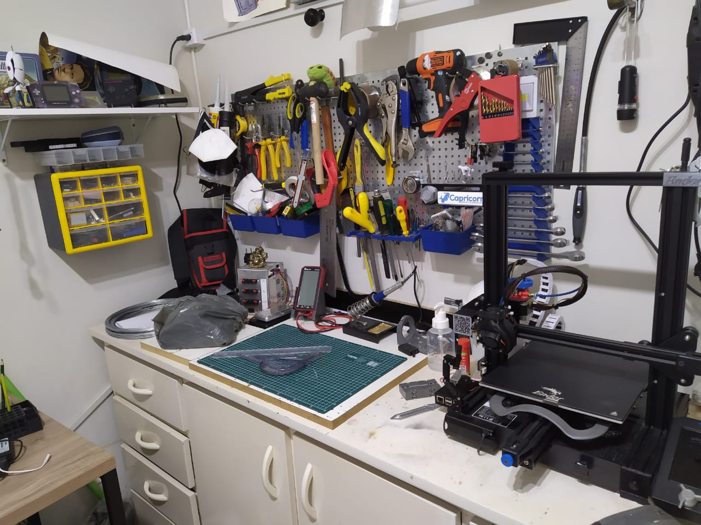
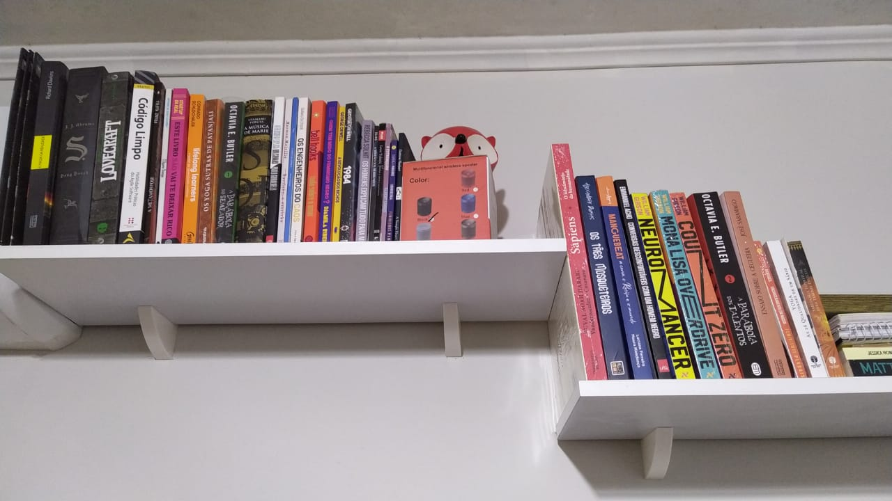
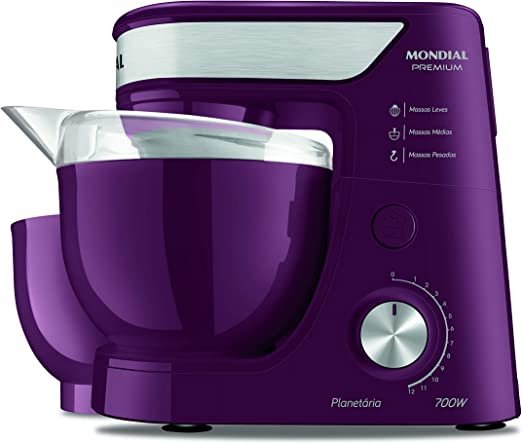
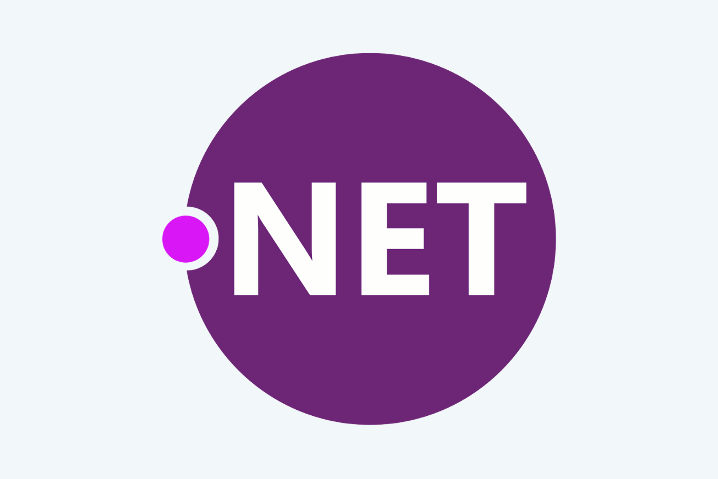
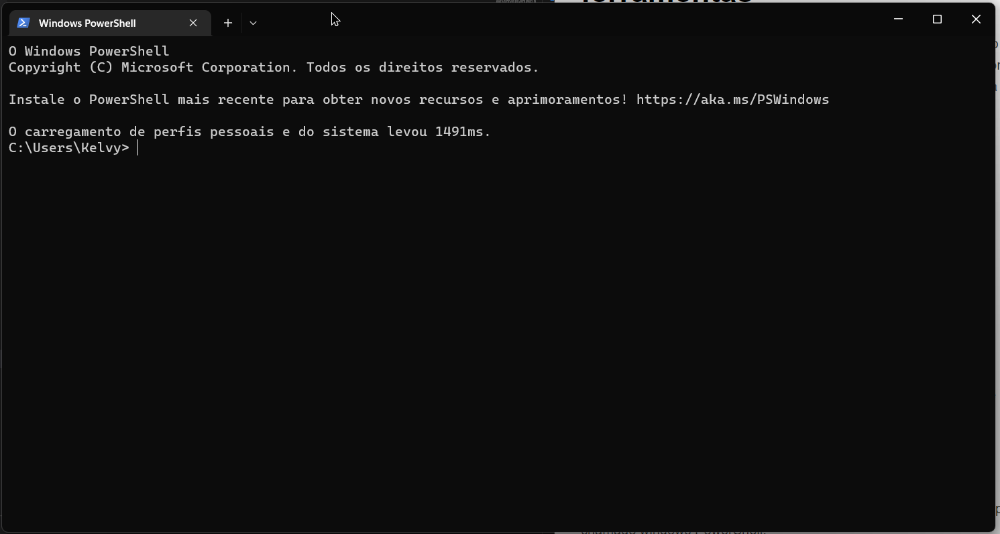

# Modulo 2 Aula 3 - Introdução a Programação


### O Framework 

O que que é um framework?
Podemos imaginar um framework como um conjunto de materiais e ferramentas para construirmos nossos programas, como se fosse uma bancada de uma oficina, com tudo que você precisa pra construir concertar coisas desde os materiais ate o ferramental:



Existem muitos frameworks disponíveis cada um com suas vantagens e desvantagens, e como as ferramentas em uma oficina devemos utilizar a ferramenta certa para o problema especifico, não devemos utilizar um martelo para apertar um parafuso, e nem vice-versa.

Para o Desenvolvimento de jogos podemos escolher alguns frameworks que também são amplamente utilizados na construção das mais diversas aplicações, como por exemplo .net ou python.

Um framework pode suportar uma ou mais linguagens de programação, por exemplo o .net usualmente e utilizado o C# como linguagem mas também suporta VB.net, F# dentre outras cada uma com seu objetivo especifico.
Outro exemplo seria o Python que no caso suporta apenas a linguagem Python.

 **Importante não confundir engine de jogo com framework, a maioria dos engines suporta um ou mais frameworks, e consequentemente linguagens de programação diferentes, como por exemplo o Unity suporta C# com o .Net ou C++ como linguagem nativa, ou GODOT que também suporta o C# .net como também o GDScript (linguagem baseada no python) como linguagem nativa**


### IDE

Uma IDE e nada mais do que um editor de texto especializado em escrever código, temos vários sabores de IDE's desde os maios simples ate os mais complexos, eles vem acompanhados de inúmeras ferramentas para auxiliar o processo de criação de programas, como auto-completar, correção de código, sinalização de erros, etc.
Uma IDE pode ser especifica de alguma linguagem ou framework, como pro exemplo o poderoso 'Visual Studio' que es especifico para o framework .Net, ou generalista para ser utilizado em diversas linguagens e frameworks como os eu versátil irmão mais menor o 'Visual Studio Code'. 
A escolha depende de vários fatores, como a linguagem, a complexidade do programa a ser feito, mas resumindo se for um programa mais complexo recomendo o 'Visual Studio' para todos os os outros casos o 'Visual Ctudio Code' que e mais leve.


## Bibliotecas



 Algo que temos que ter em mente também e o conceito de bibliotecas, em programação uma biblioteca e um conjunto de códigos uteis para um determinado fim, por exemplo podemos ter uma biblioteca de funções matemáticas, assim quando precisarmos calcular o fatorial de alguma coisa não precisaremos escrever todo o código para isso, ja reutilizaremos o que ja existe na biblioteca.

  **O Framework também e/contém um grande conjunto de bibliotecas**

## Algorítimos  


Algoritmos são como receitas de bolo, você tem os ingredientes e os passos que que que seguir para conseguir um bolo no final do processo:

Ingredientes:

3 - Ovos
1 e 1/2 xícaras - Leite
3 xícaras - Farinha
2 Xícaras - Açúcar
4 Colheres - Margarina
1 Colher - Fermento

Passos:

1. Misturar ingredientes sólidos 
2. Separar as Gemas das claras
3. Juntar a manteiga e as Gemas aos ingredientes sólidos ja misturados.
4. Bater as claras em neve.
5. Incorporar (não bater) as clara em neve aos demais ingredientes ja misturados.
6. Preaquecer o forno em 180 graus.
7. levar ao forno por 40 minutos ou ate o bolo ficar totalmente cozido.

Os nossos ingredientes são nossos recursos ou valores e os passos são nosso algorítimo, uma sequencia de passos que devem ser executado em um determinada ordem para que o resultado final seja atingido.

A descrição clássica do que é um algorítimo e grande e complexa mas vou deixar aqui por curiosidade:

**Um algoritmo é uma sequência de raciocínios, instruções ou operações para alcançar um objetivo, sendo necessário que os passos sejam finitos e operados sistematicamente. Um algoritmo, portanto, conta com a entrada (input) e saída (output) de informações mediadas pelas instruções.**

Na nossa receita de bolo a entrada (input) são os ingredientes, e a saída e o bolo.
 
 
## Funções



Funções são pequenos trechos de código que realizam alguma operação, estas funções podem conter ou não entradas e podem conter ou não saídas. esses trechos de código podem ser reutilizados, sendo assim muito uteis para evitar repetição de código que é o 8º pecado capital.

No nosso exemplo da receita de bolo poderíamos considerar uma função chamada Misturar, por ser um processo que se repete por todo o algoritmo, a entrada dessa função seriam os ingrediente a serem misturados, e a saída seria os ingredientes já misturados.


# Instalando o Framework e as ferramentas

Para prepararmos a bancada da nossa oficina precisaremos instalar o Framework e a IDE, nos utilizaremos o Framework .net versão 7, e como IDE utilizaremos o 'Visual Studio Code', vou apresentar dois métodos para instalar nossas ferramentas.




### Metodo 1 - Instaladores

Para isso precisaremos baixar os dois instaladores dos sites oficiais:

[Framework .Net](https://dotnet.microsoft.com/en-us/download/dotnet/thank-you/sdk-7.0.102-windows-x64-installer)

[Visual Studio Code](https://code.visualstudio.com/docs/?dv=win64user)

Depois disso basta executar os instaladores e seguir as instruções de instalação.

Easy Game.


### Metodo 2 - Linha de comando

Para isso abriremos um programa que todo computador com window possui, chamado windows PowerShell:



neste programa podemos executar comandos para realizar qualquer coisa no windows, mas isso e uma historia para outra aula, o que precisamos saber e aqui e quais comandos executar:

1. Para instalar o Framework basta copiar e colar esse comando e depois teclar 'enter', e então aguardar o fim da instalação:

```winget install Microsoft.DotNet.SDK.7```

1. Para instalar o visual studio code o comando e o seguinte:

```winget install Microsoft.VisualStudioCode```

Agora nossa bancada está pronta.