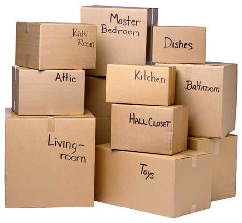

# Modulo 2 Aula 4 - Variáveis - C#

### O que são variáveis?  



Vamos imaginar uma variável como uma caixa onde guardamos coisas dentro dela, e do lado de fora da caixa escrevemos o tipo de coisa que esta dentro desta caixa.
E quando escrevemos na caixa que dentro dela estão pratos (ou um prato) não poderemos colocar copos dentro dela.

No C# que utilizaremos neste curso temos alguns tipos básicos de variáveis que são chamados de tipos primitivos, são alguns deles: 

* **char** = Representa uma única letra.
* **int** = Representa um numero inteiro.
* **double** = Representa um numero com casas decimais.
* **Bool** = Representa um valor verdadeiro ou falso.
* **string** = e um conjunto de letras ou seja um texto (string e um primitivo impostor, ja que ele não é realmente um primitivo ja que deriva do char)

Por enquanto vamos nos concentrar nestes tipos existem muitos outros além dos tipos complexos que veremos na pratica nas futuras aulas.

Nas linguagens de programação existem palavras especiais, que são utilizadas para executar certos comandos, no caso temos uma palavre especial para criar uma variável em C# =,ela e a 'var', tudo minusculo.

A criação de uma variável e feita da seguinte maneira:
palavra chave 'var' seguida do nom,e da variável utilizado para identificar a mesma pelo seu código e por você e no final o valor que guardaremos nela no inicio, **esse valor que colocamos inicialmente dentro de nossa variável também define o tipo dela**. 

Exemplo: vamos criar uma variável chamada idade e colocar um numero 37 dentro dela, sendo assim ela e do tipo int.

```C#
var idade = 37;
```

Analisando esse comando:

* O nome de uma variável deve sempre se claro, não pode conter espaços, e não pode iniciar com numero, também não deve começar com letra maiúscula, para diferenciar palavras no nome de uma variável usamos letras maiúsculas no meio ex.: idadeMaxima (o M de máxima e maiúsculo mas o i de idade por ser no inicio e minusculo),

* O '=' no comando significa atribuição o que quer dizer que atribuímos o valor que esta a direita do '=' na variável que esta a esquerda do '='.

* E claro no final de todo comando devemos colocar um ';' para indicar que o comando foi finalizado, existem algumas excessos a esta regra que falaremos mais afrente no curso.

Podemos também deixar explicito qual o tipo de nossa variável neste caso trocamos a palavra especial 'var' pelo tipo da variável, neste modo não precisamos ja colocar um valor na variável a caixa pode ficar vazia, portem essa não ´´e uma boa pratica, digamos que não faz pare do código de etiqueta da programação e pode causar bugs, por isso e importante sempre que possível quando criar uma variável ja colocar um valor nela:

```C#
int idade;
idade = 37;
```

Neste exemplo a variável foi criada vazia e na linha seguinte voi atribuído o valor 37;